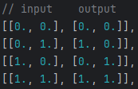

# A (basic) deep learning framework in Rust
This is an effort to really learn rust and refresh my knowledge of training neural networks. The API is inspired by PyTorch.

I've really enjoyed my time using Rust so far. Planning to add many more features and statistical results for common datasets.

Currently, all work is done on the CPU. Now focused on accelerating computation using OpenCL and/or Cuda.

### Example of training
Using two hidden layers of 4 neurons with leaky ReLU activation, an output layer with Sigmoid activation, BCE error, and SGD optimizer.

Training targets:\

Training results:\

## Implemented Features
### Layers

- Dense / Fully Connected

### Activations

- Leaky ReLU
- Sigmoid
- Tanh

### Loss Functions

- Mean Square Error
- Mean Absolute Error
- Binary Cross Entropy

### Optimizers

- Stochastic Gradient Descent
- (planned) Adam

## Acceleration Libraries
Currently, only NDArray is used. This package can be accelerated using BLAS.
