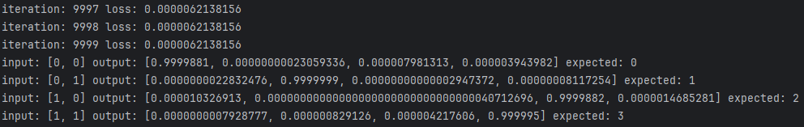

# A (basic) deep learning framework in Rust
This is an effort to really learn rust and refresh my knowledge of training neural networks. The API is inspired by PyTorch.

I've really enjoyed my time using Rust so far. Planning to add many more features and statistical results for common datasets.

Currently, all work is done on the CPU. Now focused on accelerating computation using Vulkan compute shaders.

### Example of training
Using two hidden layers of 4 neurons with leaky ReLU activation, an output layer with Sigmoid activation, Sparse Categorical Cross Entropy loss, and SGD optimizer with momentum and L2 regularization.

Training targets:\

Training results:\

## Implemented Features
### Layers

- Dense / Linear / Fully Connected
- (planned) Bilinear
- (planned) Convolutional
- (planned) Embedding

### Activations

- Leaky ReLU
- Sigmoid
- Softmax
- Tanh

### Loss Functions

- Mean Square Error
- Mean Absolute Error
- Binary Cross Entropy
- Categorical Cross Entropy
- Sparse Categorical Cross Entropy

### Optimizers

- Stochastic Gradient Descent
- (planned) RMS Propagation
- (planned) Adam

## Acceleration Libraries
Currently, only NDArray is used. This package can be accelerated using multithreading and various BLAS.
